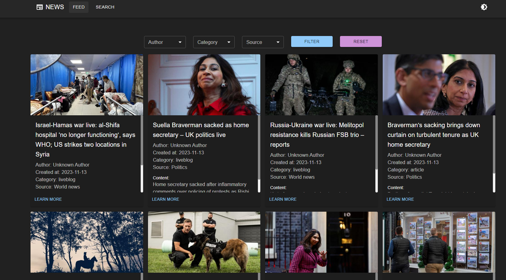

# News Feed Application

## Proposed Solution:
I have implemented a news aggregator solution that incorporates two distinct interfaces: /feed and /search. These interfaces offer an intuitive and user-friendly experience for accessing news content. To retrieve the news, I have mainly used three api: "NewsAPI", "The Guardian", and "New York Times".

### /feed Interface:
This interface provides a curated feed of news content, complete with dynamic filters for authors, sources, and categories. Users can easily customize their news feed based on their preferences, enhancing their overall browsing experience.

### /search interface:
This interface empowers users to perform targeted searches using specific keyword. Users can further refine their findings through filters such as source, category, and publication date (from date, to date). This ensures that users can quickly locate the information they need.

Both interfaces present a grid layout showcasing news cards with a pagination for seamless navigation.

Each news card contains:
* Thumbnail image: takes a "no-image" image for news retrieved from New York Times Api.
* Title.
* Author: takes "Unknown Author" for news retrieved from the Guardian Api or if its not provided in the New York Times Api result as well. 
* Category: takes "Unknown Category" for news retrieved from NewsApi. 
* Source. 
* Publication date. 
* A small content description. 

The user can learn more about a specific news by clicking on "Learn More" which redirects to the article's page.

## Some Screenshots:

## How to run:
1. Clone the repo using `git clone https://github.com/Achraf-haddar/news-feed.git`
2. Inside the news-feed folder run the following commands:
   `docker build -t news-feed-app .`
   
   `docker run -p 3000:3000 news-feed-app`
3. Try it by calling [http://localhost:3000/feed](http://localhost:3000/feed)

### Happy Reviewing 🎉